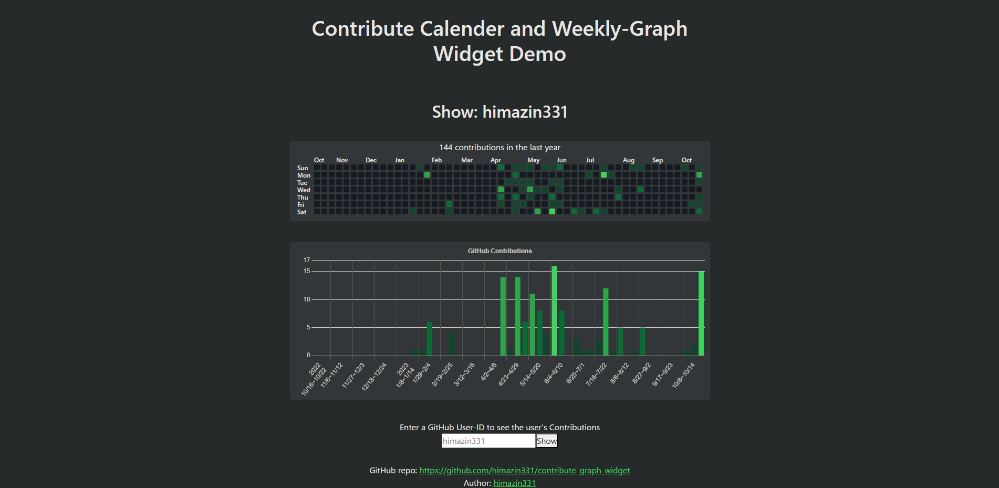

# GitHub Contribute Calender and Weekly-Graph Widget Demo



## Demo page
https://contribute-graph-widget.vercel.app/

## Description
It retrieves a user's Contributions via the [GitHub GraphQL API](https://docs.github.com/en/graphql) and displays a widget like [GitHub's Contribution Calender](https://docs.github.com/en/account-and-profile/setting-up-and-managing-your-github-profile/managing-contribution-settings-on-your-profile/viewing-contributions-on-your-profile#contributions-calendar) and a weekly Contribution Graph widget.

The source code may be used, modified, and reused for commercial and non-commercial purposes.

## Package Install
Developed by Next.js.

The following packages should be installed at the time of use
```
$ npm install --save react-bootstrap chart.js react-chartjs-2 node-fetch
```
Notes: Bootstrap is introduced for the Tooltips component. If you implement Tooltips on your own, it is not necessary.